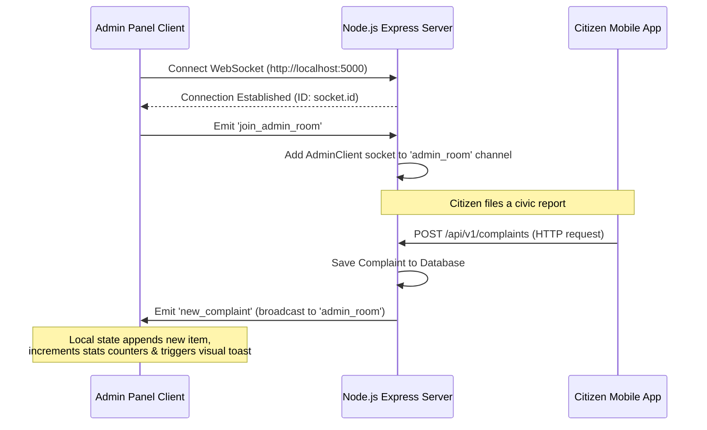

# React Admin Dashboard Architecture: CityFix

This document describes the design patterns, code layouts, and architectural systems driving the **CityFix React Admin Dashboard & Authority Operations Panel**.

---

## 1. Directory Structure

The admin panel codebase is organized as follows:

```
admin/
├── tailwind.config.js     # Tailwind CSS theme settings
├── postcss.config.js      # PostCSS configurations
├── index.html             # HTML entry point (Inter / Outfit typography fonts)
├── src/
│   ├── main.jsx           # App initialization
│   ├── App.jsx           # Provider wrappers (Auth, Sockets, React Router)
│   ├── index.css          # Core styles, glassmorphic layout tokens, status badge utilities
│   ├── components/        # Shared presentation widgets
│   ├── pages/             # Dynamic dashboard views
│   │   ├── Login.jsx      # Glassmorphic Login card & validation filters
│   │   ├── Overview.jsx   # Dynamic dashboard home, stats cards, and Recharts charts
│   │   ├── Complaints.jsx # Complaints data grid table & operations desk audit modal
│   │   └── GeospatialHeatmap.jsx # Interactive radar mockup density overlay placeholder
│   ├── layouts/
│   │   └── DashboardLayout.jsx # Collapsible navigation sidebar, header notifications center, user profile
│   ├── providers/
│   │   ├── AuthProvider.jsx # Handles session persistence, credentials query, and role limits
│   │   └── SocketProvider.jsx # Connects Socket.IO, enters admin_room, handles room joins
│   ├── services/
│   │   └── api.js         # Axios HTTP broker, intercepts JWT tokens & unauthenticated 401 timeouts
│   ├── routes/
│   │   └── AppRoutes.jsx  # Routes matching rules and ProtectedRoute layout gates
│   ├── hooks/             # Custom responsive reactive hooks (optional extensions)
│   ├── utils/             # Helper formatters (optional extensions)
│   └── widgets/           # Visual dashboard components (optional extensions)
```

---

## 2. Authentication & Protected Routing System

* **Auth Context State:** Governed by `AuthProvider.jsx`. Handles local token loading, logins calling `POST /auth/login`, and session clears on signouts.
* **Role Verification:** Gates guests strictly by enforcing that only accounts with roles `admin` or `authority` can log into the portal.
* **Axios HTTP Broker (`api.js`):** Injects active JWT session tokens into headers (`Bearer token`) automatically for each outgoing request. Intercepts `401 Unauthorized` API responses to immediately dispatch a custom `auth-session-expired` event to log the user out in real-time.
* **Protected Guards (`AppRoutes.jsx`):** Wraps administrative routes with a `<ProtectedRoute>` component, intercepting unauthenticated attempts and sending guests back to `/login`.

---

## 3. Realtime WebSockets Lifecycle Flow (Socket.IO)



* **Dynamic Events Subscriptions:**
  - `new_complaint`: Fired by the backend when a citizen registers an issue. The Admin Dashboard automatically reads the payload to update overview counters in-memory, prepend the item in the alert feeds registry, and trigger a popup.
  - `complaint_status_updated`: Fired when a status gets modified. Triggers an automatic REST stats fetch to sync visual Recharts graphs and update state items live.

---

## 4. Recharts Visual Analytics Architecture

Operational analytics are mapped responsively inside `Overview.jsx` utilizing **Recharts**:
1. **Complaint Trends (AreaChart):** Displays filed reports vs. resolved counts over time.
2. **Category distribution (PieChart):** Illustrates category counts proportionately (e.g. Road, Waste, Water, Streetlight) with inline custom legends.
3. **Status distribution (BarChart):** Highlights volume metrics based on issue statuses.
